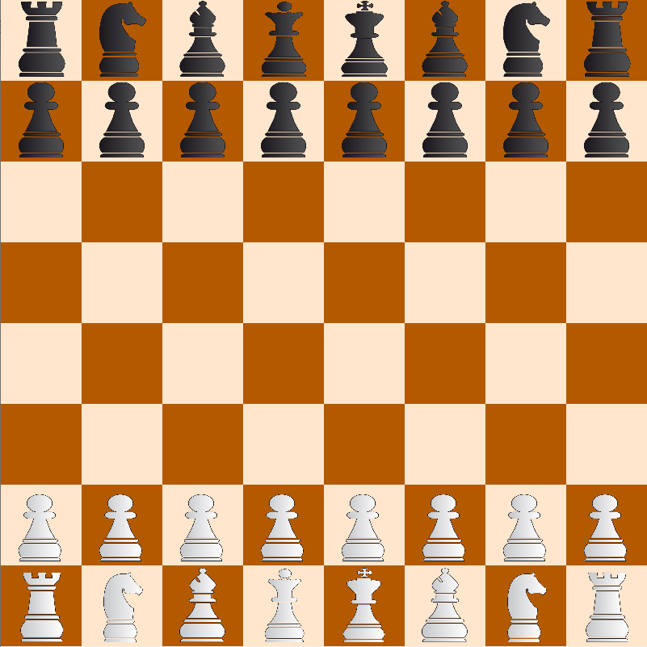
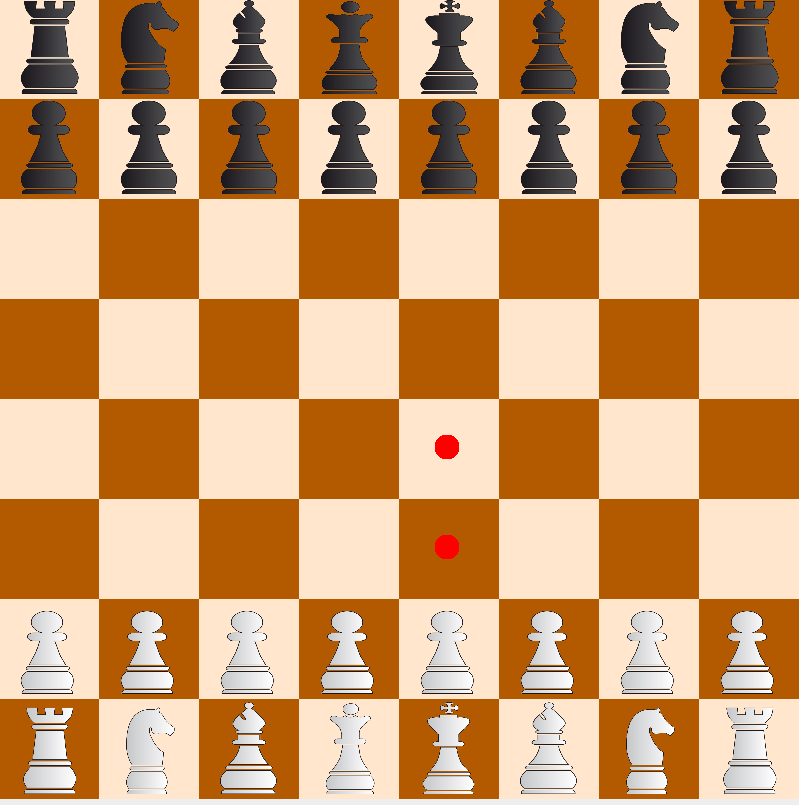
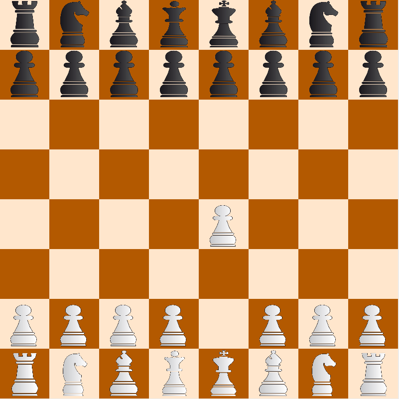

# Chess game with Monte-Carlo Tree Search Algorithm and Minimax

This chess game can be played against an Artificial Intelligence algorithm based on Monte-Carlo Tree Search and Minimax algorithms.
It is also possible to play against another human player or to watch 2 AIs play against each other.
The maximum allowed time for the AI turn needs to be specified at the beginning of the game.
## Run

You need to have Java installed on your computer.

To launch the game, run:

```
cd src
javac game/Launcher.java
java game.Launcher
```
Or you can launch it in any IDE by running the file src/game/Launcher.java.

## Play

You can then choose the game mode between Player vs Player, Player vs AI and AI vs AI. If an AI is used, the time limit given to the AI must be specified in seconds.

You will also be asked if you want to play first or not. The white player always plays first in chess.

You will now see the following chess board:



To move a piece, select it with your left click. You will see the different possible moves with red dots, as in the following image.



 You can finally release the piece by clicking on the chosen cell. 

 

  If you have selected a piece and changed your mind, you can unselect it using the right click.

 It is now the opponent's turn, which can be either another player, or an AI. Can you beat the AI?


